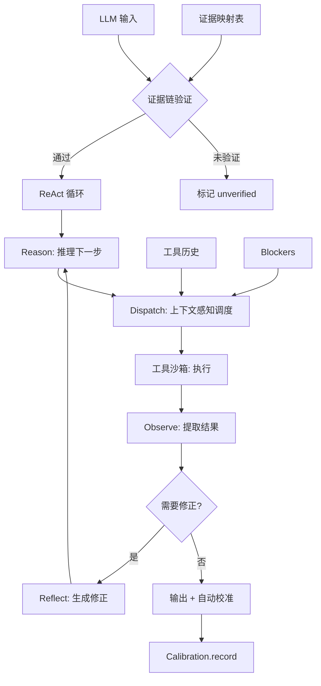

# ZeroApex 真正推理核心

Feature Name: 2026-07-23-reasoning-core
Updated: 2026-07-23

## Description

补全 ZeroApex 引擎的推理能力，从"规则匹配 + 安全网"升级为"结构化推理引擎"。四个核心模块：证据链验证、自动校准、上下文感知调度、ReAct 推理循环，外加工具沙箱隔离。

## Architecture



## Components and Interfaces

### §31 EvidenceChain（证据链验证）

替换 Hallucination 的关键词匹配为结构化证据验证。

```
EvidenceChain.verify(statement, evidenceRef) → { valid, reason }
EvidenceChain.link(toolExecutionId, resultSummary) → void
EvidenceChain.getClaims(executionId) → Claim[]
```

- 每个工具执行后，引擎自动 `link(execId, resultSummary)`
- LLM 输出声明时，必须传入 `evidenceRef` 指向执行 ID
- 验证逻辑：执行存在 → 执行状态为 done → resultSummary 与声明语义兼容

### §32 AutoCalibration（自动校准）

工具执行完成后自动记录校准数据，替代手动 `record()`。

```
AutoCalibration.onToolComplete(toolName, predicted, actual) → void
AutoCalibration.getBias(toolName) → { bias, confidence }
```

- `predicted`: 工具推荐时的预期成功率（来自 smart_dispatch 的 risk_level）
- `actual`: 执行结果映射（成功=81-100区间中值，失败=0）
- 按 toolName 分组统计偏差

### §33 ContextDispatch（上下文感知调度）

基于目标依赖分析 + 历史工具结果 + 当前 blockers 的智能调度。

```
ContextDispatch.analyze(goal, context) → { steps[], risk, tools[] }
ContextDispatch.resolveBlockers(blockers) → ToolRec[]
```

- 解析目标中的依赖关键词（"先构建再部署" → [构建, 部署]）
- 历史失败 → 推荐诊断工具（log_viewer, debug_info）
- 有未解决 blockers → 只推荐信息收集类工具

### §34 ReActLoop（推理循环）

多步推理执行引擎，带步骤记忆和回溯。

```
ReActLoop.create(goal, options) → LoopHandle
ReActLoop.step() → { phase, output, done }
ReActLoop.backtrack(stepIndex) → void
```

- Phase 序列：reason → act → observe → reflect → reason
- 最大步数：10（可配置）
- 步骤记忆：完整记录每步的推理、工具选择、执行结果
- 回溯：执行失败时可回退到任意步骤重新推理

### §35 ToolSandbox（工具沙箱）

工具执行隔离层。

```
ToolSandbox.execute(toolFn, params, options) → { result, timedOut, truncated }
```

- 超时：默认 30s，可配置
- 输出截断：默认 8KB
- 异常捕获：所有异常转为标准化错误
- 资源限制：递归深度、内存占用检查

## Data Models

```javascript
// 证据链
EvidenceLink {
  executionId: string,       // 工具执行 ID
  toolName: string,          // 工具名称
  resultSummary: string,     // 结果摘要（如"编译成功 0 errors"）
  timestamp: string,         // ISO 时间戳
  claims: Claim[]            // 关联的声明列表
}

Claim {
  text: string,              // 声明文本
  evidenceRef: string,       // 引用的执行 ID
  status: "verified" | "unverified" | "invalid"
}

// ReAct 步骤
ReActStep {
  index: number,
  phase: "reason" | "act" | "observe" | "reflect",
  reasoning: string,         // 推理文本
  toolName: string,          // 选择的工具
  toolParams: object,        // 工具参数
  toolResult: object,        // 执行结果
  observation: string,       // 结果观察
  correction: string,        // 修正策略（reflect 阶段）
}

// 校准记录（扩展）
CalibrationEntry {
  toolName: string,          // 按工具分组
  predicted: number,
  actual: number,
  timestamp: string,
}
```

## Correctness Properties

1. **证据链完整性**: 每个 verified 声明必须有一个 done 状态的工具执行
2. **校准单调性**: 校准数据越多，bias 估计越稳定（不会因新数据大幅波动）
3. **ReAct 终止性**: 循环必定在 maxSteps 内终止
4. **沙箱隔离性**: 工具异常不影响引擎主循环
5. **调度一致性**: 相同目标+相同上下文 → 相同调度结果

## Error Handling

| 场景 | 处理 |
|------|------|
| 工具超时 | 返回 timeout 错误，ReAct 进入 reflect |
| 执行异常 | 沙箱捕获，返回标准化错误码 |
| 证据链断裂 | 标记 unverified，不拦截但警告 |
| 校准数据不足 | 退化为默认 readiness 计算 |
| ReAct 超过 maxSteps | 强制终止，返回当前最佳结果 |

## Test Strategy

1. **EvidenceChain**: 模拟工具执行 → 声明引用 → 验证通过/失败
2. **AutoCalibration**: 连续执行工具 → 检查 record 自动写入
3. **ContextDispatch**: 给定目标+历史 → 验证工具推荐合理性
4. **ReActLoop**: 模拟多步任务 → 验证循环终止 + 回溯正确
5. **ToolSandbox**: 构造超时/异常工具 → 验证隔离

每个模块独立测试 + 端到端集成测试。

## References

- `engine/zero_apex.js` §11 (TaskLedger) — 任务队列模式参考
- `engine/zero_apex.js` §30 (Calibration) — 校准数据结构参考
- `tests/test_zero_apex.js` — 测试模式参考
